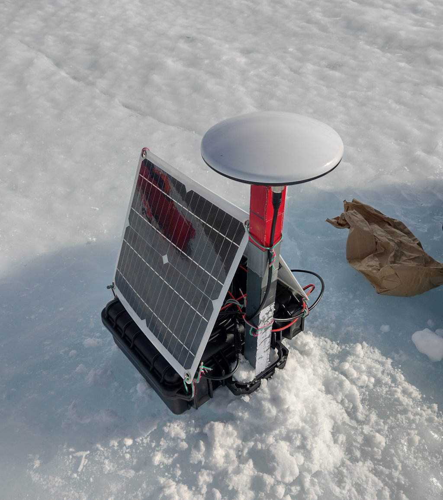

# u-Blox ZED-F9P GNSS receiver raw UBX data logger for Arduino

This code will save raw GNSS messages in u-Blox's proprietary UBX format
to an SD card connected to an Arduino microcontroller. The UBX data files
can later be post-processed into precise positioning using software like
RTKLIB. You can also use RTKLIB to convert UBX to RINEX format and then
send the raw data to an online PPP service to do the processing for you.
(Natural Resources Canada provide a good one)

In this way GPS/GNSS postions can be post-processed to better than 2 cm
accuracy.

For a full description see our main project page at hs/LowCostGNSS

---

u-Blox RAWX and SFRBX binary messages are written out once every 10 seconds.
This should be fine for static installations, as well as those moving
at glacial speeds. Many PPP services will decimate this to once every
30 seconds during processing anyway. You can set it to log once a second
but the data files will start to get pretty big.

This code was written for the following hardware, but may be compatible
with similar or more powerful boards.

* u-Blox high precision ZED-F9P RTK receiver board (Eltehs ELT0087)  
  _We have also successfully tested it with the u-Blox C099-F9P application board_
* Arduino microcontroller Adafruit Feather Cortex M0 Adalogger (SAMD21 chip)
* I2C communication between the GNSS receiver and Arduino
* A 12 volt battery connected to a solar controller and small 10 watt panel

The whole set up is relatively low cost and consumes around half a watt.
A description and build instructions for the hardware are also included
in the hardware/ directory.

It uses the SparkFun u-Blox GNSS Arduino library, and was inspired by their
included raw data logging example <DataLoggingExample3_RXM_SFRBX_and_RAWX> by
Paul Clark (MIT licensed). A compatible version of this library is included
in the contrib/ directory for posterity.

It also uses the Temperature Zero library by Electronic Cats and friends
(MIT licensed) to read the Cortex M0's temperature. This is easily
disabled if you are not using a SAMD21 or SAMD51 microprocessor.

Daily log files are written to the SD card in NOAA NGS naming style:  
  `YYYY/MM/IIDDjjjn.UBX`

Where YYYY is the year,  
MM is the month,  
IIDD is a user-definable logger ID,  
jjj is the day of the year,  
and n is the starting hour (UTC, presented as a letter A-X for 00-23).

Note we write out daily files not hourly ones, and break things up into
monthly directories, so it's not exactly true to the NOAA NGS naming style.

In addition hourly status reports including basic positioning information,
battery voltage, and the M0's temperature is written to a monthly status
file called STATUS.LOG within that month's directory.

---

An analysis of the GNSS receiver and overview of the processing is given in
Still et al. 2023 (_J. Glaciology_, DOI: _TBD_) based on a deployment in
Terra Nova Bay and the Priestley Glacier, Antarctica.

This code is licensed under the GPL version >= 3. See the GPL-3.txt file found
in the src/ directory.

The description of the circuit board and build instructions are licensed under
the Creative Commons Attribution-NonCommercial-ShareAlike 4.0 International
(CC BY-NC-SA 4.0) license.

You may also find this project on Codeberg.org

Have fun! =)
